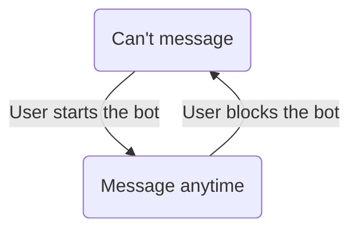

# How to Manage the Lifecycle of Private Chats

Private chats are the main place for onboarding, settings, support, and any flow that should not happen in a group.

Even if your bot is designed to work in groups or channels, implement a small private-chat flow.
When people open the bot profile, they should get a greeting, a help screen, or a way to add the bot to a group.
For group bots, this can be an “Add to your group” link built with [deep links for groups.](links#deep-links-for-groups)

Below we will discuss the chat lifecycle. 

tl;dr: Don't try to message users who haven't contacted the bot, and remember that users block the bot again.




## Treat `/start` as the main entry point

A private chat usually starts when the user opens the bot with a link or by searching in the app.
Telegram then shows [the intro text](botfather#customization) and the “Start” button.

When the user clicks the button, the `/start` command is sent,
which signals that the private chat has begun.
The bot should answer this command with a greeting, usage instructions, or the main menu.

::: tabs key:libraries variant:code
== aiogram
```python
@dp.message(CommandStart())
async def handle_start(message: Message):
    await message.answer('Hi!')
```
== Folds
```python
@bot.private_commands.start()
async def handle_start():
    return 'Hi!'
```
== Telethon
```python
@client.on(events.NewMessage(pattern='^/start( .+)?$'))
async def handle_start(event: Message):
    await event.respond('Hi!')
```

The regexp accepts `/start` with some text after it in case a deep link is used.
Deep links are explained [on the links page.](links)
== Other libraries
<HelpNeeded/>
:::


Just like any other chat, the dialog with the bot appears in the user's recent chat list.

::: warning
Do not assume `/start` means this is the user's first interaction with the bot.
Make sure your bot handles situations where a user sends `/start`
after they've already initiated a dialog previously.
:::

::: tip Extra input
Use [deep links](links) when the `/start` message should contain additional information.
:::

## Use other entry points

Sometimes Telegram allows a bot to contact a user through another entry point.
This can happen when:

- The user [requested to join](join-requests) a group or channel where the bot manages join requests.
- The user [authorized with Log In with Telegram](login-widget) and allowed the bot to contact them.

In these cases, the Telegram app shows the user an explanation of why the bot is contacting them.

## Remember that only users can start dialogs

Design private-chat flows around the user opening the dialog first.
A bot cannot send private messages to a user until the user has started the dialog, except for specific Telegram entry points described below.
Once the dialog exists, the bot can keep sending messages unless the user blocks it.

Bots also cannot casually message other bots like normal users do.
Newer [bot-to-bot communication](bot-automation#bot-to-bot-communication) requires explicit support and loop protection.

## Keep replies in the right topic

Some bot dialogs can use forum-style topics in private chats.
This is especially useful for AI assistants and support bots that need to keep several threads separate.

If your bot receives messages with private-chat topic information, store the thread ID and send replies to the same topic.
Otherwise responses may appear in the wrong conversation.

## Handle users blocking your bot { #block }

A user can block the bot at any time.
After that, the bot cannot send personal messages to the user until they unblock it.

Treat this as a normal state: if a send attempt fails because the bot is blocked, stop retrying the same personal message and wait for the user to return.

## Check if users have your bot blocked

If you need to check whether a user has blocked the bot, try a lightweight chat action before sending the actual message.

Attempt to show a “Bot is typing...” status in the dialog.
If Telegram servers return an error, it means the bot can't
send messages to the user—so either the user has blocked the bot or the dialog has never started.

This action has minimal rate limiting, so you can do it frequently.

::: tabs key:libraries variant:code
== aiogram
```python
try:
    await bot.send_chat_action(chat, 'typing')
except TelegramForbiddenError:
    print("Can't send messages")
```
== Telethon & Folds
```python
try:
    async with client.action(user, 'typing'):
        pass
except UserIsBlockedError:
    print("Can't send messages")
```
== Other libraries
<HelpNeeded/>
:::
