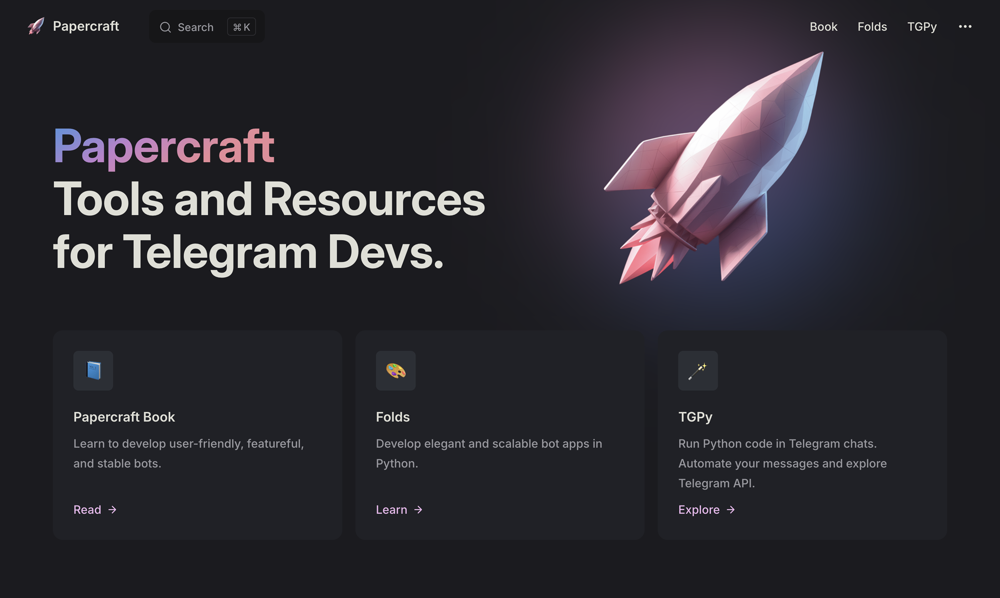

<br>
<br>


<div align="center">

<div>

</div>

# Papercraft

Tools and resources for Telegram devs.

**https://papercraft.tmat.me/**

</div>

&nbsp;

<a href="https://papercraft.tmat.me/">



</a>


&nbsp;

&nbsp;

## Repositories

This repo is for the Papercraft website. See also: 

- [Folds](https://github.com/tm-a-t/folds)
- [TGPy](https://github.com/tm-a-t/tgpy)

## Licensing

This repository uses split licensing:

- The Papercraft website code and other repo-owned source files are licensed under the [MIT License](LICENSE).
- The authored Papercraft Book text in [`pages/book`](pages/book) and [`pages/ru/book`](pages/ru/book) is licensed under [CC BY-NC 4.0](LICENSE.book.md).
- Third-party or separately licensed assets and synced content, including files under [`pages/public`](pages/public), [`pages/folds`](pages/folds), and [`pages/tgpy`](pages/tgpy), are not relicensed by these files unless noted otherwise.

## Edit the site

Feel free to PR!

The pages are stored as Markdown files in the [`pages`](pages) directory.
The site is based on [Vitepress.](https://vitepress.dev/guide/what-is-vitepress)

You can just edit the files on GitHub, but if you wish to run the site locally — 
clone the repo, download `yarn` and install dependencies:

```shell
yarn
```

Then run:

```shell
yarn dev
```


